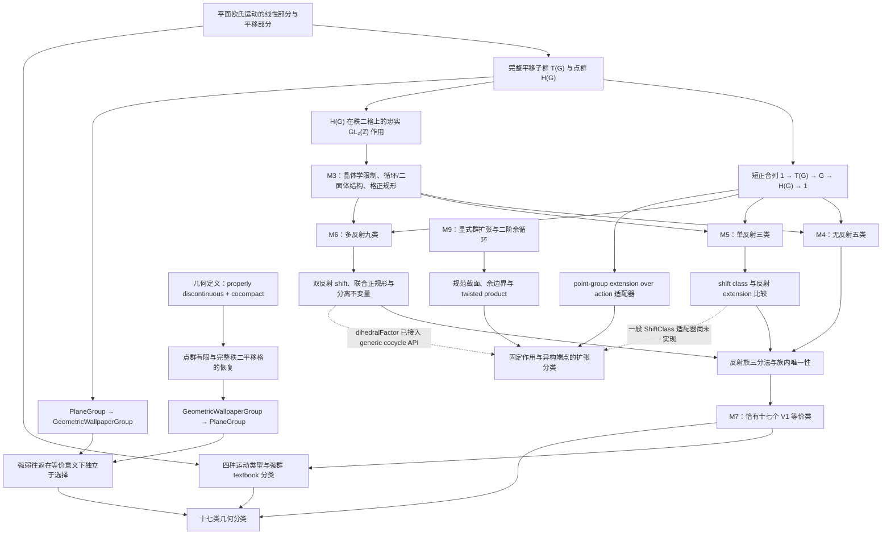
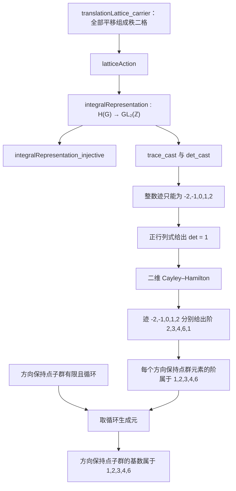
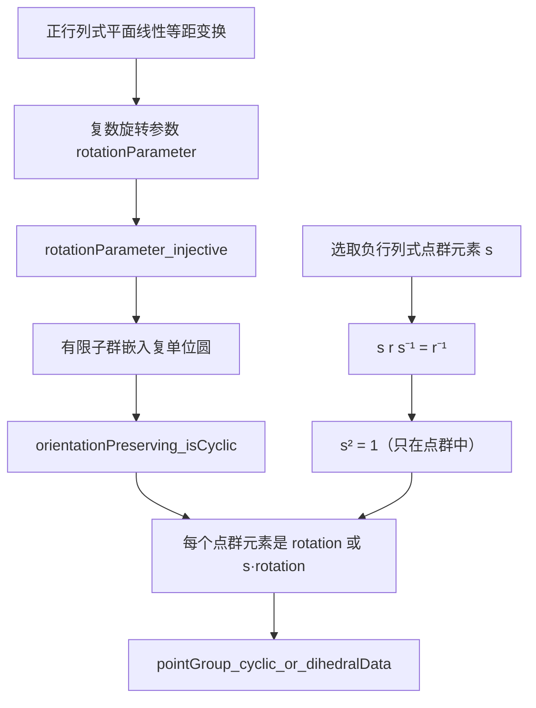
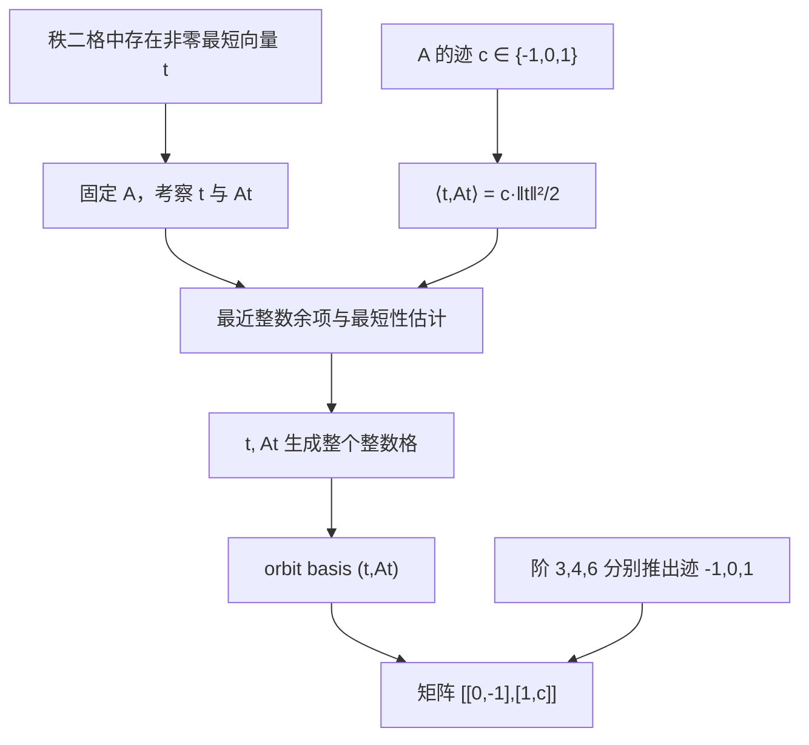

# 中文数学证明讲义：总览、形式化边界与声明审计

> 状态：结构与声明审计稿，已同步至当前源码；不是证明正文。
>
> 源码基线：`main@2cba9284f7226649a77a6b12b6b042ad89d3541d`
> （Lean `4.33.0`，mathlib `v4.33.0`）。
>
> 讲义分支：`exposition-zh`，已合入上述 `main` 基线。

## 0. 本阶段的范围与当前基线

本阶段只确定讲义的数学边界、目录、依赖关系和 Lean 对照框架，不开始撰写各章的完整证明。

当前同步结果如下。

- `main` 已包含完整的 V1 分类、M8 几何桥接和 M9 显式扩张理论，并已升级至
  Lean/mathlib `4.33.0`。
- `exposition-zh` 已合入当前 `main`；讲义设计不再落后于源码基线。
- V1 的 M0–M7、V2 的 M8a–M8c，以及 M9a–M9b 的核心理论均已完成并通过人工审核。
- `TranslationPreservingIso`、一般 `ShiftClass`、`FiniteCosetData`、秩 `n` 专门化和抽象
  `H²` 比较仍是明确延期的适配层，不属于 `m9-complete`。
- 当前远端只保留 `main` 和 `exposition-zh` 两个分支；原 V2 实现分支已删除，但提交与标签仍保留。

本次审计依次核对了项目规范、V1/V2 路线图、实际进度、foundation decisions、现存 review
文档以及实际 Lean 源码。数学结论以源码 declaration 为最终依据。需要特别注意：

- [ROADMAP.md](../ROADMAP.md) 是已经完成的 V1 历史记录；
- [ROADMAP_V2.md](../ROADMAP_V2.md) 保存 V2 的原始规范性规划；其 M9 适配器目标后来被项目所有者
  明确延期，因此不能只看路线图中的初始 acceptance criteria 判断当前完成范围；
- [PROGRESS.md](../PROGRESS.md) 和已批准的 M8/M9 review 文档记录实际完成范围，是当前状态的
  直接依据；
- [V2_COMPLETION.md](../V2_COMPLETION.md) 是 M8 完成时的阶段性快照，不能用来判断 M9 状态；
- 项目没有独立的 M4、M5、M6 review 文件；相关批准边界主要记录在
  [FOUNDATION_DECISIONS.md](../FOUNDATION_DECISIONS.md) 的 FD-012 至 FD-014、路线图和源码中。

## 1. 必须贯穿全书的形式化边界

### 1.1 `PlaneGroup` 是强定义

[`PlaneGroup`](../../WallpaperGroups/Basic/PlaneGroup.lean) 已经包含：

1. 一个平面欧氏运动子群 `carrier`；
2. 一个带选定整基的秩二平移格 `translationLattice`；
3. 该格的载体恰好等于群中**全部**平移向量构成的整数子模；
4. 点群有限。

因此 V1 分类定理并不是从“离散且余紧”两个字段直接推导出来的。离散性和余紧性在 M8
中从强定义推出；反方向则从几何定义恢复点群有限性和完整秩二平移格。

### 1.2 四种容易混淆的关系

| 关系 | Lean declaration | 精确含义 | 不包含的条件 |
|---|---|---|---|
| V1 等价 | `PlaneGroup.Equivalent` | 存在保持完整平移子群的抽象群同构 | 不要求由平面等距变换共轭；不保持度量或选定格基 |
| 强群的 textbook 等价 | `PlaneGroup.TextbookEquivalent` | 存在保持平移、旋转、反射、滑移反射四类运动的抽象群同构 | 仍不是环境欧氏共轭 |
| 几何群的 textbook 等价 | `GeometricWallpaperGroup.TextbookEquivalent` | 几何载体之间保持四类运动的抽象群同构 | 仍不是环境欧氏共轭 |
| 欧氏共轭 | 本项目没有把它作为最终分类关系 | 存在一个环境平面等距变换作共轭 | 不能与前三者互换使用 |

源码中的两个主要桥梁是：

```text
PlaneGroup.textbookEquivalent_iff_equivalent
GeometricWallpaperGroup.textbookEquivalent_iff_equivalent
```

第一个证明强群的 textbook 等价与 V1 等价逻辑等价；第二个把几何群的直接 textbook 关系
识别为恢复出的强群之间的 `PlaneGroup.Equivalent`。它们都不会把抽象群同构升级为欧氏共轭。

### 1.3 非规范选择与真正不变量

全书统一采用以下表达原则。

| 非规范数据 | Lean 中的消除方式 | 讲义中的表述 |
|---|---|---|
| `RankTwoLattice.basis` | `PlaneGroup.reframe_equivalent`；作用矩阵作 `GL₂(ℤ)` 共轭 | 基是计算坐标，不是分类不变量 |
| 点群生成元 | 用点群阶、作用共轭类和模型唯一性消除 | 只在局部证明中固定 |
| 仿射提升（lift） | `shiftClass_lift_independent`；换 lift 增加 norm | 原始 lift 幂不是不变量，商类才是 |
| 扩张截面（section） | `NormalizedSection.toCocycle_change`；两个二阶余循环相差显式余边界 | factor 依赖截面，`CocycleCohomologous` 类不依赖 |
| 几何定义恢复出的格基 | `GeometricWallpaperGroup.toPlaneGroup_choice_independent` | 往返只声称等价，不声称结构相等 |
| 最短向量与 orbit basis | `Nonempty` 的正规形存在定理 | 正规形存在，但没有规范选取 |

特别地，`TranslationPreservingIso.realLinearEquiv` 只是实线性同构，一般不是线性等距同构。

## 2. 建议的完整目录

审计后建议把原拟议的“无反射与单反射分类”拆成两章。单反射分类中的反射格正规形、
lift、norm 与 shift class 已经足以构成一章；若与无反射合并，会掩盖两类证明方法的本质差异。

| 文件 | 拟议标题 | 核心范围 |
|---|---|---|
| `00_总览与定理依赖.md` | 总览、形式化边界与定理依赖 | 本文件；讲义阅读路线、关系区分、依赖图 |
| `01_平面等距变换_平移格与强平面群.md` | 平面等距变换、平移格与强 `PlaneGroup` | 运动分解、完整平移子群、点群、短正合列、忠实整数作用、换基与 V1 等价 |
| `02_二维晶体学限制定理.md` | 二维晶体学限制定理 | 方向保持点子群的循环性、阶数限制、反向元与二面体数据、`q=3,4,6` 格正规形 |
| `03_无反射分类.md` | 无反射平面群的五类分类 | 循环点群、extension splitting、旋转模型、按点群阶的存在唯一性 |
| `04_单反射分类.md` | 单反射平面群的三类分类 | primitive/centered 反射格、lift 调整、shift class、`cm/pm/pg` |
| `05_多反射分类与十七类定理.md` | 多反射九类与十七类总分类 | 联合正规形、两个反射 lift、九类存在唯一性、跨族分离、17 类与等价类基数 |
| `06_运动类型_几何定义与强定义桥接.md` | 运动类型、几何定义与强定义桥接 | 四类运动、textbook 等价、proper discontinuity、余紧性、强弱定义双向转换、几何分类 |
| `07_后编_群扩张_截面与二阶余循环.md` | 后编：群扩张、规范截面、二阶余循环与扭曲积 | M9 显式扩张理论、固定与异构端点分类、现有适配器及延期项 |
| `LEAN_DECLARATION_INDEX.md` | Lean declaration 双向索引 | 讲义概念到 declaration，以及源码文件到章节的反向索引 |

主证明阅读路线是

```text
01 → 02 → 03/04/05 → 06。
```

第 07 章是独立后编：它解释 V1 中 extension、factor 与 shift 计算背后的统一理论，并为未来
高维空间群工作提供基础，但**不是**十七类定理或 M8 几何分类的逻辑前提。

本次同步新增 declaration 索引；其余章节正文仍应在结构审核后逐章创建。

## 3. 全书主要定理依赖图

下图表示数学依赖，而不是 Lean import 图。



M9 支线不参与 `L` 或 `S` 的证明；它抽象并验证扩张计算的统一结构。最后一条虚线只表示
概念联系。当前源码没有把 V1 的一般 `ShiftClass` 分类结果统一接入 M9 的 generic cocycle
classifier；讲义不得把这条虚线写成已形式化定理。

## 4. M3 样章的声明级依赖

### 4.1 阶数限制



元素级阶数限制的实质输入是完整秩二格所给出的忠实整数表示和二维等距几何。点群有限性主要在
“整个方向保持子群有循环生成元并谈其基数”时进入。

### 4.2 循环与二面体结构



`DihedralData` 是内部结构数据，不是与某个约定下 `DihedralGroup n` 的显式同构。定理中的
“循环或存在二面体数据”也不是互斥析取：在退化的二元素情形，两侧可能同时成立。

### 4.3 `q=3,4,6` 的格正规形



所得 basis、最短向量和矩阵正规形都是存在性的、非规范的。矩阵是在新构造的 orbit basis
中成立，不必在 `PlaneGroup.translationLattice.basis` 中成立。

## 5. 各章证明风格与强定义负担

| 章节 | 可采用的标准数学证明 | 必须解释的项目特有内容 |
|---|---|---|
| 01 | 欧氏运动的线性/平移分解、核与商 | `RankTwoLattice` 带选定基；`PlaneGroup` 内置完整格和有限点群；`Equivalent` 的精确边界 |
| 02 | 单位圆有限子群、迹与 Cayley–Hamilton、最短向量论证 | 从强格得到忠实 `GL₂(ℤ)` 作用；矩阵的 basis 依赖；`DihedralData` 的退化边界 |
| 03 | 循环扩张与半直积的标准论证 | lift 的选取、分裂证明的准确输入、从格作用正规形到 translation-preserving equivalence |
| 04 | 反射的线性正规形 | primitive/centered 是整格作用类型；raw lift square 不是不变量；shift quotient 的自然性 |
| 05 | 二面体生成关系的部分群论 | 两个相邻反射的选择、双 shift 调整、有限陪集模型、`cmm/pmm` 与 `p3m1/p31m` 的额外分离量 |
| 06 | proper discontinuity、余紧性与紧基本域论证 | 项目选用的是作用意义的离散性；恢复格基非规范；三种 equivalence 关系必须分开 |
| 07（后编） | Schreier factor、二阶余循环、twisted product | 固定作用/固定端点的精确分类范围；异构端点 transport 需显式 action equivalence；哪些 V1 adapter 仍缺失 |

## 6. 第一篇样章的推荐范围

建议第一篇样章严格限定为 `02_二维晶体学限制定理.md`，从强 `PlaneGroup` 的输入开始，
到 `q=3,4,6` 的 orbit-basis 正规形结束。不要在样章中进入无反射 extension splitting，
也不要提前讨论单反射 shift class。

### 6.1 详细提纲

1. **本章输入与符号**
   - 定义 \(T(G)\)、\(H(G)\)、\(H^+(G)\)；
   - 明列 `PlaneGroup` 已编码的完整秩二格与点群有限性；
   - 说明选定格基只用于坐标化。
2. **点群对平移格的忠实作用**
   - 从共轭平移公式得到 \(H(G)\curvearrowright T(G)\)；
   - 得到 \(H(G)\hookrightarrow \mathrm{GL}_2(\mathbb Z)\)；
   - 区分环境线性等距变换与其整数矩阵。
3. **方向保持点子群**
   - 用行列式正号定义 \(H^+(G)\)；
   - 证明正行列式平面线性等距变换的行列式为 \(1\)。
4. **循环性**
   - 固定一次平面的复坐标；
   - 构造并证明 `rotationParameter` 单射；
   - 由复单位圆有限子群循环推出 \(H^+(G)\) 循环；
   - 说明复坐标不是最终分类数据。
5. **方向反转元的共轭公式**
   - 对 \(s\notin H^+(G)\)、\(r\in H^+(G)\) 证明 \(srs^{-1}=r^{-1}\)；
   - 推出 \(s^2=1\)；
   - 强调这是点群中的线性元，不能推出任意 affine lift 的平方为一。
6. **点群的 cyclic/dihedral data**
   - 证明每个点群元素属于 \(H^+\) 或 \(sH^+\)；
   - 精确陈述 `DihedralData` 的字段；
   - 解释“or”不互斥以及为何源码没有声称显式 `DihedralGroup n` 同构。
7. **整数迹桥**
   - 定义格作用矩阵；
   - 证明整数矩阵的实数化与环境线性变换在格实基中的矩阵一致；
   - 推出迹和行列式的 cast 等式。
8. **迹的五种可能**
   - 平面线性等距变换的实迹位于 \([-2,2]\)；
   - 利用迹为整数得到 \(-2,-1,0,1,2\) 五种可能；
   - 处理迹为 \(\pm2\) 的边界等号。
9. **Cayley–Hamilton 与精确阶**
   - 在 \(\det=1\) 下写出二次特征恒等式；
   - 连续推出
     \[
     \operatorname{tr}=-2,-1,0,1,2
       \Longrightarrow \operatorname{ord}=2,3,4,6,1;
     \]
   - 逐项排除更小的阶。
10. **晶体学限制定理的元素版与子群版**
    - 元素版：每个 \(h\in H^+(G)\) 的阶属于 \(1,2,3,4,6\)；
    - 子群版：利用循环生成元，\(|H^+(G)|\) 属于同一集合；
    - 分开标注两版实际使用的假设。
11. **最短向量与 orbit basis**
    - 证明秩二格中存在非零最短向量；
    - 对阶 \(3,4,6\) 的作用 \(A\) 证明 \(t,At\) 是实线性无关；
    - 用内积公式与最近整数余项证明二者生成整个格。
12. **三种格作用正规形**
    - 在列向量约定下得到
      \[
      q=3:\begin{pmatrix}0&-1\\1&-1\end{pmatrix},\qquad
      q=4:\begin{pmatrix}0&-1\\1&0\end{pmatrix},\qquad
      q=6:\begin{pmatrix}0&-1\\1&1\end{pmatrix};
      \]
    - 说明没有相应的 `q=1,2` `LatticeActionNormalForm` bundle；
    - 说明没有固定尺度、Gram 矩阵或到标准单位格的欧氏共轭结论。
13. **本章边界与后续依赖**
    - 本章不给出五个无反射群的分类；
    - 本章不给出 extension splitting；
    - 本章不给出 glide/reflection lift 的分类；
    - 指向第 03、04、05 章的依赖。

### 6.2 每个主要定理的固定 Lean 对照框

样章正文中每个主要定理之后统一加入：

```text
Source file:
Declaration:
Lean statement:
Mathematical interpretation:
Additional encoded assumptions:
Role in the classification:
Difference from the exposition:
```

其中 `Lean statement` 将按源码保留真实量词和假设；`Role in the classification` 说明该定理在
后续哪一段分类中被消费；`Difference from the exposition` 只说明记号、叙述顺序或被单独展开的
中间步骤，不改变 theorem 的强弱。

## 7. M9 核心已完成，但以下适配器不得写成现有定理

当前源码已经形式化：

- 显式 `AdditiveAction`、规范二阶余循环、规范一阶 cochain 与余边界；
- twisted product、规范截面、factor 提取和截面改变公式；
- 固定作用下任意扩张的分类；
- action、kernel、quotient 的 transport 与 heterogeneous extension classifier；
- 现有 point-group extension 和 `dihedralFactor` 的薄适配器。

以下内容尚未完成相应的一般性 adapter，并已在 [PROGRESS.md](../PROGRESS.md) 中明确延期：

- 从任意 `TranslationPreservingIso` 自动产生 M9 的一般 action/extension transport；
- 把一般 `ShiftClass` 直接识别为某个 generic cyclic cocycle class；
- 把一般 `FiniteCosetData` 直接接入 generic cocycle classifier；
- 任意秩 \(n\) 晶体扩张的专门化分类；
- 与 mathlib 或其他库中抽象 \(H^2\) 的比较定理。

第 07 章可以解释这些概念为什么相关，但必须清楚区分“已形式化的 generic core”与“动机、
预期适配或未形式化联系”。

## 8. 等待审核的设计决策

开始样章正文前需要确认：

1. 是否接受把无反射与单反射拆成第 03、04 两章；
2. 是否接受第 02 章的范围止于 `q=3,4,6` 格正规形；
3. 是否接受把第 07 章作为独立后编，而不作为十七类主证明链的必读章节；
4. 是否接受把 M9 尚未完成的 adapter 集中列入第 07 章的“形式化边界”，而不把它们写成定理；
5. 是否接受每章先给连续数学证明，再在主要定理后附七字段 Lean 对照框。

## 9. 建议的下一步

结构审核通过后，按以下顺序推进：

1. 使用 [LEAN_DECLARATION_INDEX.md](LEAN_DECLARATION_INDEX.md) 固定讲义概念与当前 Lean declaration 的映射；
2. 只撰写 `02_二维晶体学限制定理.md` 样章；
3. 样章审核后再决定是否按目录顺序展开其余章节。

不要同时启动多章正文，也不要为了讲义叙述方便而改变已经批准的 theorem statement。
